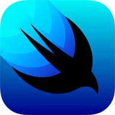
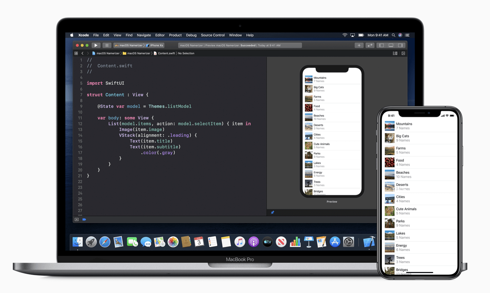
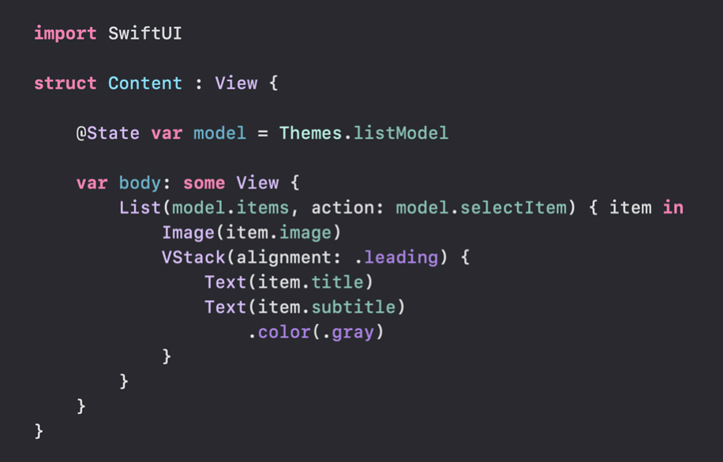
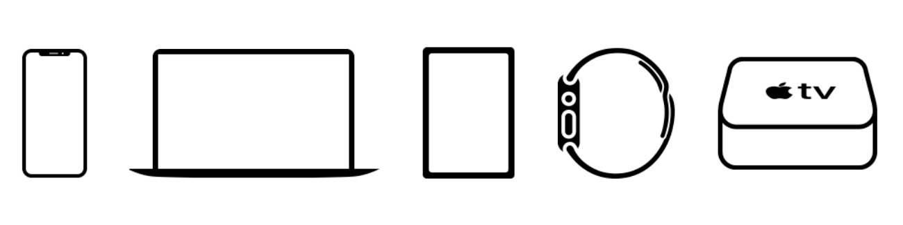

## SwiftUI

### 使用更少的代码创建更好的应用

SwiftUI是一种使用Swift语言在苹果设备上构建用户界面的创新且简单的方式。使用SwiftUI在苹果设备上创建用户界面可以使用一套统一的工具和API。SwiftUI使用声明式的Swift语法，代码易读并且写起来很自然。同时它可以和Xcode中的设计工具配合使用，让设计工具中的展示样式和代码同步起来。使用SwiftUI创建的用户界面自动支持了**动态类型(Dynamic Type)**、**暗黑模式(Dark Mode)**、**语言本地化(Localization)**以及**所有人都可以使用的可访问性(Accessibility)**，也就是说，创建用户界面时，SwiftUI写的代码比使用其它方式写的代码具有更多的功能。

### 声明式语法

SwiftUI使用声明式的语法，可以非常简单的描述用户界面的样式。如果想要创建一个列表，列表中的每一项都包含文本，每一个文本都要设置不同的对齐方式、字体样式、文字颜色，使用SwiftUI来实现这样一个界面所写的代码比之前更加简单、易读，可以节省时间和维护成本。

这种声明式的语法甚至可以应用到像动画这种复杂的概念中。只需要短短几行代码，就可以把一系列动画效果应用到任何控件上。为了保证应用的稳定运行，动画在执行过程中的细节由系统负责处理。添加动画效果变的非常容易，这样应用就可以添加各种动画效果，让整个应用变的充满活力。

### 设计工具

**Xcode 11**提供了配合SwiftUI的新设计工具，它比较直观，可以通过拖拽的方式创建用户界面。在设计工具的画布中创建用户界面时，代码编辑器中可以同步自动创建出对应的代码。当设计发生更变时，Xcode会及时的重新编译并展示在预览视图中，可以随时修改，所见即所得。

**拖拽** 就是在设计工具的画布上拖放控件，可视化的布局界面。点击控件打开**检查器(inspector)**后，可选择不同的字体、颜色、对齐方式以及其它设计选项，也可以使用鼠标拖动布局控件。这些可视化的编辑器有一部分也可以在代码编辑器中使用，即使你更喜欢手写代码来创建用户界面，也可以使用**检查器(inspector)**来了解控件属性和样式修改器。可以直接从控件库中拖控件到设计工具的画布上，也可以直接写代码来布局界面。

**动态替换** Swift的编译器和运行时环境完全嵌入在Xcode中，应用可以实时编译并运行，设计工具中画布展示的样子就是真实运行时的用户界面。使用Swift动态替换的新特性，Xcode可以直接让修改后的代码在实时预览模式下展示出来。

**预览** 对于SwiftUI创建的视图，使用不同样本数据，可以创建一个甚至多个不同场景下的预览，这些预览可以针对任何设备类型或设备方向进行。

### 所有苹果设备原生支持SwiftUI

 苹果沉淀了十几年用户界面创建经验，SwiftUI就建立在这些经验之上。用户在苹果生态下的独特体验被完美的融入在SwiftUI的代码设计中。SwiftUI是原生支持的，这就是说通过写少量的代码或者使用设计工具在画布上设计就可以使用苹果各硬件平台提供的已有技术和功能。

