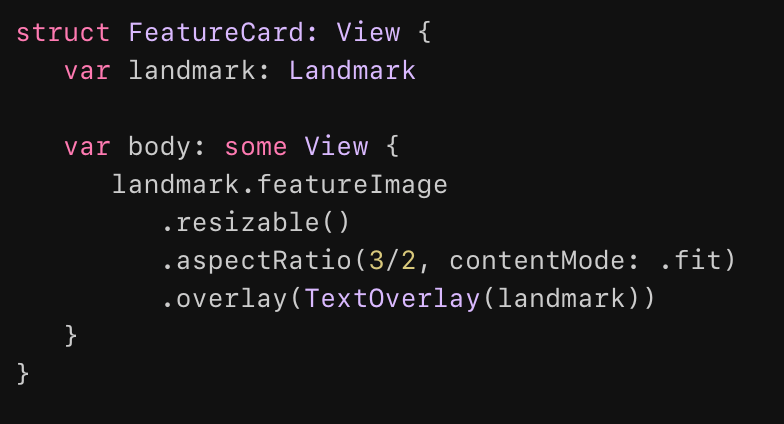
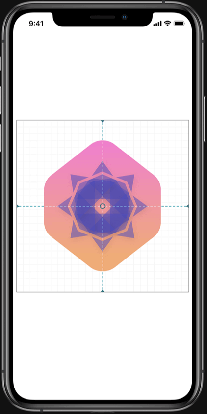

SwiftUI是在苹果设备上创建用户界面的一种现代方法。可以更快的创建漂亮且充满活力的应用。

## 只需要描述一次布局

声明式描述任何状态下的视图内容和布局。SwiftUI知道视图何时发生状态改变，并及时刷新对应状态下的视图内容。

## 构建可复用组件

把多个目标单一的小视图组合成功能复杂的大视图进而组合成复杂的用户界面。同时自定义的视图还可以在不同的苹果平台设备应用开发中复用。

## 简化动画效果实现

创建流畅的动画效果仅仅需要添加一个方法调用就可以完成。SwiftUI负责在必要时进行动画效果的内部计算和转场处理。

## Xcode中实时预览

不需要实际运行应用就可以完成设计、构建和测试工作。使用交互式的预览功能来测试你开发的控件和页面布局。

