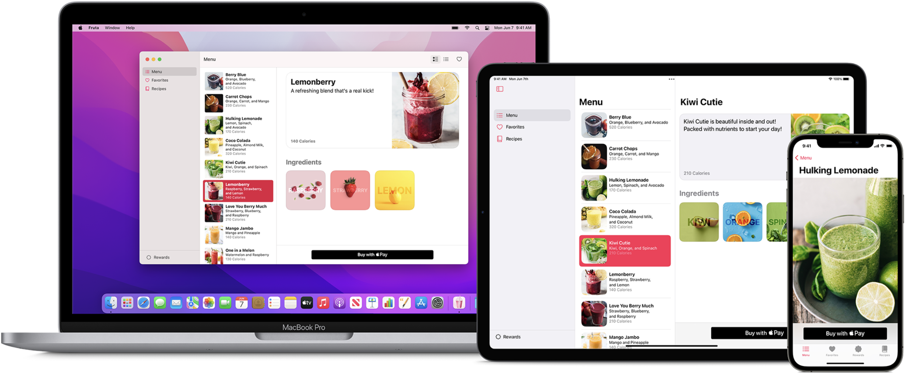

## SwiftUI

借助 SwiftUI，您可以利用 Swift 的强大功能打造适合各个 Apple 平台的精美 app，而无需编写大量代码。SwiftUI 让您只需使用一套工具和 API，就能在任何 Apple 设备上为所有用户带来更加出色的体验。



## SwiftUI 新功能

- **先进的 app 体验和工具**：您可以利用新功能增强您的 app，例如改进的列表视图、更好的搜索体验，以及对控制专注模式的支持。此外，还可以利用新的画布 API 这个 drawRect 的现代 GPU 加速替代方案，提高对底层绘图语言的控制。

- **辅助功能改进**：利用新的 Rotor API，以简单列表形式在屏幕上显示最相关的项目，从而加快互动速度。当前的辅助功能焦点状态 (例如旁白光标) 现在可以朗读出来，甚至可以通过编程方式进行更改。而借助新的辅助功能表示 API，您的自定控件即可轻松继承现有标准 SwiftUI 控件的完整辅助功能支持。

- **macOS 上的 SwiftUI 改进**：新的性能与 API 可用性改进，包括多列表格支持，让您的 macOS app 变得更加出色。

- **全天候视网膜显示屏支持**：在 Apple Watch Series 5 及更新机型上，全天候视网膜显示屏让 watchOS app 即使在表盘变暗后，也能始终显示，重要信息一目了然。

- **适用于 iPadOS 的小组件**：现在，小组件可以放在主屏幕中的任意位置上，而且尺寸进一步增大，带来全新的超大小组件。

## 声明式语法

SwiftUI 采用声明式语法，您只需声明用户界面应具备的功能便可。例如，您可以写明您需要一个由文本栏组成的项目列表，然后描述各个栏位的对齐方式、字体和颜色。您的代码比以往更加简单直观和易于理解，可以节省您的时间和维护工作。

```swift
import SwiftUI

struct Content: View {

    @State var model = Themes.listModel

    var body: some View {

        List(model.items, action: model.selectItem) { item in 

            Image(item.image)

            VStack(alignment: .leading) {

                Text(item.title)

                Text(item.subtitle).color(.gray)
                
            }
        }
    }
}
```

这种声明式风格甚至适用于动画等复杂的概念。只需几行代码，就能轻松地向几乎任何控件添加动画并选择一系列即时可用的特效。在运行时，系统会处理所有必要的步骤和中断因素，来保证您的代码流畅运行、保持稳定。实现动画效果是如此简单，您还能探索新的方式让 app 更生动出彩。

## 设计工具

Xcode 包含直观的设计工具，只需拖放操作就能使用 SwiftUI 轻松构建界面。当您在设计画布中操作时，您的每一项编辑都会与相邻编辑器中的代码保持完全同步。在您键入时代码会立即以预览形式显示，您对预览进行的任何更改会立即反映在您的代码中。Xcode 会即时重新编译您的更改，并将它们插入到 app 的运行版本中，方便您随时查看和编辑。


- **拖放操作**：只需在画布上拖放控件，就能调整组件在用户界面中的位置。点按打开检查器，即可选择字体、颜色、对齐方式和其他设计选项，并可通过光标轻松重新排列控件。多数这些可视化编辑器也可在代码编辑器中使用，因此您可以使用检查器来探索各个控件的新修饰符，即使您偏好手动编写界面组件代码也没问题。您还可以将控件从资源库拖放到设计画布上，或者直接拖放到代码中。

- **动态替换**：Swift 编译器和运行时已全面嵌入到 Xcode 中，您可以随时构建和运行您的 app。您看到的设计画布不仅看起来像是用户界面——它确实就是您实时运行的 app。此外，借助 Swift 中新推出的“动态替换”功能，Xcode 可以直接在实时运行的 app 中替换编辑后的代码。

- **预览**：您现在可以为任何 SwiftUI 视图创建一个或多个预览来获取样本数据。用户能看见的任何内容 (例如大字体、本地化或深色模式)，你几乎都能配置。预览也可以显示您的 UI 在任何设备和方向上的呈现效果。

## 所有苹果设备原生支持SwiftUI


---

SwiftUI是在苹果设备上创建用户界面的一种现代方法。可以更快的创建漂亮且充满活力的应用。


## 只需要描述一次布局

声明式描述任何状态下的视图内容和布局。SwiftUI知道视图何时发生状态改变，并及时刷新对应状态下的视图内容。


## 构建可复用组件

把多个目标单一的小视图组合成功能复杂的大视图进而组合成复杂的用户界面。同时自定义的视图还可以在不同的苹果平台设备应用开发中复用。


## 简化动画效果实现

创建流畅的动画效果仅仅需要添加一个方法调用就可以完成。SwiftUI负责在必要时进行动画效果的内部计算和转场处理。


## Xcode中实时预览

不需要实际运行应用就可以完成设计、构建和测试工作。使用交互式的预览功能来测试你开发的控件和页面布局。


